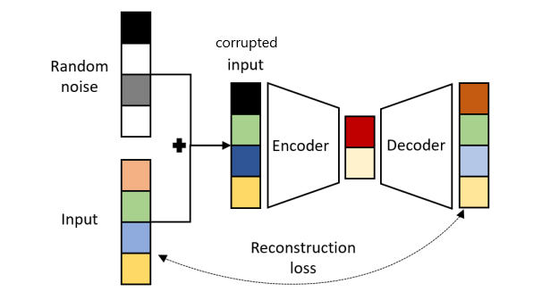

# Denoising-Autoencoder

An autoencoder is a specific type of a neural network, which is mainly designed to encode the input into a compressed and meaningful representation, and then decode it back such that the reconstructed input is similar as possible to the original one.

Denoising autoencoders can be viewed either as a regularization option, or as a robust autoencoder which can be used for error correction. In these architectures, the input is distrupted by some noise (e.g., additive white Gaussian noise or erasures using Dropout) and the autoencoder is expected to reconstruct the clear version of the input.

Two common noise options for disrupting inputs images are:
1. **Gaussian Noise** 
$\tilde x$ is  random variable, whose distribution is given by  $$C_{\sigma}(\tilde x|x) = \mathcal{N}(x, \sigma^2 \mathcal{I})$$
The variance parameter $\sigma$ sets the impact of the noise.
  
2. **Bernoulli Noise** 
$\tilde x$ is  random variable, whose distribution is given by  $$C_{p}(\tilde x|x) = \mathcal{\beta} \odot x, \hspace{3mm} \beta \sim Ber(p)$$
where $\odot$ denotes an element wise (Hadamard) product. The parameter $p$ sets the probability of a value in $x$ not being nullified.
  

In this project, both options are explored seperately in two notebooks i.e., 'BernoulliNoise.ipynb' and 'GaussianNoise.ipynb'. Convolution, Transpose Convolution layers along with Batch Normalization layers are used in the encoder-decoder blocks for feature compression and reconstruction.

**References**
1. arXiv:2003.05991 [cs.LG]
 	(or arXiv:2003.05991v2 [cs.LG] for this version) https://doi.org/10.48550/arXiv.2003.05991

